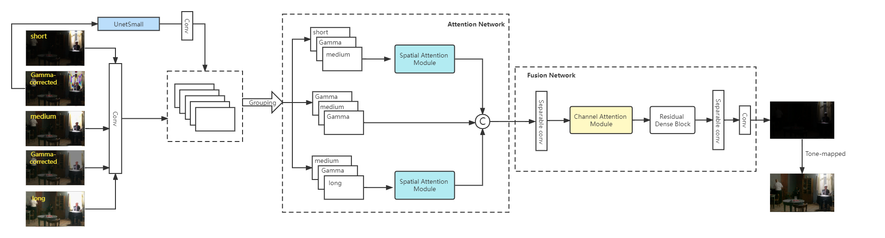

# Gamma-enhanced with spatial attention Network for Efficient High Dynamic Range Imaging
By Fangya Li, Ruipeng Gang, Chenghua Li, Jinjing Li, Sai Ma, Chengming Liu and Yizhen Cao

This project is supported by [UHD TV Research and Application Laboratory](https://github.com/gkyAiLab)

Now you can read the paper in [there](https://openaccess.thecvf.com/content/CVPR2022W/NTIRE/html/Li_Gamma-Enhanced_Spatial_Attention_Network_for_Efficient_High_Dynamic_Range_Imaging_CVPRW_2022_paper.html). The code framework is inspired by [HDRUNet](https://github.com/chxy95/HDRUNet).

## Overview
Overview of the network:
<div align="center">
  
</div>
​      


## Getting Started

1. [Dataset](#dataset)
2. [Configuration](#configuration)
3. [How to test](#how-to-test)
4. [How to train](#how-to-train)
5. [Visualization](#visualization)

### Dataset
Register a codalab account and log in, then find the download link on this page:
```
https://codalab.lisn.upsaclay.fr/competitions/1514#participate-get-data
```
#### It is strongly recommended to use the data provided by the competition organizer for training and testing, or you need at least a basic understanding of the competition data. Otherwise, you may not get the desired result.

### Configuration
```
pip install -r requirements.txt
```

### How to test

- Modify `dataroot_LDRs` and `pretrain_model_G` (you can also use the pretrained model which is provided in the `./pretrained_model`) in `./codes/options/test/test_HDR.yml`, prepare 'results' folder, then run
```
cd codes
python test.py -opt options/test/test_HDR.yml
```
The test results will be saved to `./results/testset_name`.

### How to train

- Prepare the data. Modify `input_folder` and `save_folder` in `./scripts/extract_subimgs_single.py` and prepare 'experiments' folder, then run
```
cd scripts
python extract_subimgs_single.py
```

- Modify `dataroot_short` 、`dataroot_medium` 、`dataroot_long`、`dataroot_exp` and `dataroot_ratio` 、`dataroot_GT` of train and val in `./codes/options/train/train_HDR.yml`, then run
```
cd codes
python train.py -opt options/train/train_HDR.yml
```
The models and training states will be saved to `./experiments/name`.

### Measure operations and runtime

In `./scripts`, several scripts are available. `calculate_ops_example.py` are provided by the competition organizer for measuring operations and runtime.

### Visualization

In `./scripts`, several scripts are available. `data_io.py` and `metrics.py` are provided by the competition organizer for reading/writing data and evaluation. Based on these codes, I provide a script for visualization by using the tone-mapping provided in `metrics.py`. Modify paths of the data in `./scripts/tonemapped_visualization.py` and run
```
cd scripts
python tonemapped_visualization.py
```
to visualize the images.

### Our model

Now our model is not public in there for now. If you want to get it, please contact gangruipeng@abs.ac.cn for help. There is just for the framework record.

## Acknowledgment
The code is inspired by [HDRUNet](https://github.com/chxy95/HDRUNet).
